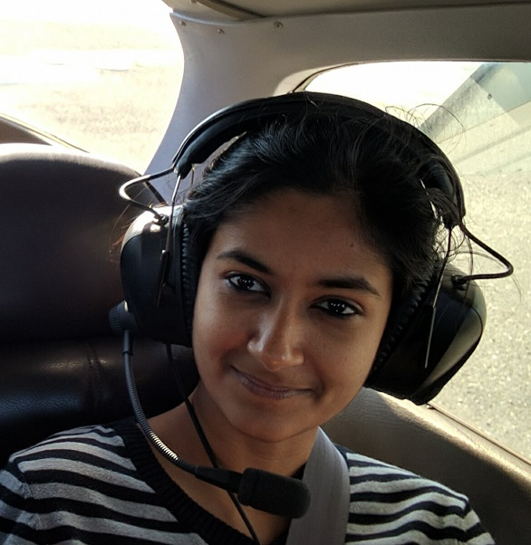

This class meets Tuesday and Thursday from 10:30 - 11:50 AM in [Packard, Room 101](https://campus-map.stanford.edu/?srch=Packard%20Electrical%20Engineering).

## Teaching Assistants

<a class="talkdate" href="https://people.stanford.edu/stanfurd/">Nathan Zhang</a>  
Office Hours TBA  

<a class="talkdate" href="http://web.stanford.edu/~nanbhas/">Nandita Bhaskhar</a>  
Office Hours TBA  

## Class Information
NSF</img>

Funding for this research/activity was partially provided by the  National Science Foundation Division of Computing and Communication Foundations under award number <a href="https://nsf.gov/awardsearch/showAward?AWD_ID=1563113&HistoricalAwards=false">1563113</a>.

## Schedule

<table width="720" class="tg">
<tbody>
<tr>
<td width="36">

<strong>Lecture</strong>

</td>
<td width="96">

<strong>Date</strong>

</td>
<td width="294">

<strong>Topic</strong>

</td>
<td width="198">

<strong>Reading</strong>

</td>
<td width="96">

<strong>Spatial Assignment</strong>

</td>
</tr>
<tr>
<td width="36">

1

</td>
<td width="96">

9/25/2018

</td>
<td width="294">

Introduction,

Softwore 2.0

Role of hardware accelerators in post Dennard&nbsp;and Moore era

</td>
<td width="198">

&nbsp;

</td>
<td width="96">

&nbsp;

</td>
</tr>
<tr>
<td width="36">

2

</td>
<td width="96">

9/27/2018

</td>
<td width="294">

Guest Lecture: Kian Katan

Classical ML algorithms: Regression, SVMs

(What is the&nbsp;building block?)

</td>
<td width="198">

<u><a href="https://ieeexplore.ieee.org/document/6241647/">Is Dark silicon useful?</a></u>  Hennessy Patterson Chapter 7.1-7.2

</td>
<td width="96">

&nbsp;

</td>
</tr>
<tr>
<td width="36">

3

</td>
<td width="96">

10/2/2018

</td>
<td width="294">

Linear algebra fundamentals and accelerating linear algebra  BLAS operations  20th century techniques: Systolic arrays and MIMDs, CGRAs

</td>
<td width="198">

<u><a href="http://www.eecs.harvard.edu/~htk/publication/1982-kung-why-systolic-architecture.pdf">Why Systolic Architectures?</a></u>  <u><a href="https://www.cs.utexas.edu/users/pingali/CS378/2008sp/papers/gotoPaper.pdf">Anatomy of high performance GEMM</a></u>

<u><a href="https://arxiv.org/abs/1602.04183">Dark Memory</a></u>

</td>
<td width="96">

</td>
</tr>
<tr>
<td width="36">

4

</td>
<td width="96">

10/4/2018

</td>
<td width="294">

Guest Lecture: Hadi Esmaeilzadeh

Tabla &amp; Cosmic

</td>
<td width="198">

<u><a href="https://www.cc.gatech.edu/~hadi/doc/paper/2015-tr-tabla.pdf">TABLA</a></u>

<u><a href="https://ieeexplore.ieee.org/document/6212466/">Codesign Tradeoffs</a></u>

</td>
<td width="96">

</td>
</tr>
<tr>
<td width="36">

5

</td>
<td width="96">

10/9/2018

</td>
<td width="294">

David Koeplinger &amp; Tian: Modeling neural networks with Spatial, Analyzing&nbsp;  performance and energy with Spatial

</td>
<td width="198">

<u><a href="https://stanford-ppl.github.io/website/papers/pldi18_koeplinger.pdf">Spatial</a></u> 
<u><a href="https://dl.acm.org/citation.cfm?id=2665689"> Aladdin </a></u>

</td>
<td width="96">

Linear Algebra  Accelerators

</td>
</tr>
<tr>
<td width="36">

6

</td>
<td width="96">

10/11/2018

</td>
<td width="294">

<strong>Evaluating Performance, Energy efficiency, Parallelism, Locality,  Memory hierarchy, Roofline model</strong>

Real-World Architectures: Putting it into practice  Accelerating GEMM:  Custom, GPU, TPU1 architectures and their GEMM performance

</td>
<td width="198">

<u><a href="https://people.eecs.berkeley.edu/~kubitron/cs252/handouts/papers/RooflineVyNoYellow.pdf">Roofline Model </a> </u>

<u><a href="https://arxiv.org/pdf/1704.04760.pdf">Google TPU</a></u>  <u><a href="http://images.nvidia.com/content/volta-architecture/pdf/volta-architecture-whitepaper.pdf">NVIDIA Tesla V100</a></u>

</td>
<td width="96">

</td>
</tr>
<tr>
<td width="36">

7

</td>
<td width="96">

10/16/2018

</td>
<td width="294">

Neural networks: MLPs and CNNs Inference

Accelerating Inference for CNNs

Blocking and parallelism

DianNao, TPUs

</td>
<td width="198">

<u><a href="http://www.rle.mit.edu/eems/wp-content/uploads/2017/11/2017_pieee_dnn.pdf">Efficient Processing of DNNs</a></u> 

<u><a href="https://arxiv.org/abs/1606.04209">Systematic Approach to Blocking</a></u>

</td>
<td width="96">

</td>
</tr>
<tr>
<td width="36">

8

</td>
<td width="96">

10/18/2018

</td>
<td width="294">

Guest Lecture: Yu-Hsin

CNN Inference

</td>
<td width="198">

<u><a href="https://people.csail.mit.edu/emer/papers/2016.06.isca.eyeriss_architecture.pdf">Eyeriss</a></u>  Google TPU (see lecture 5)
 
<u><a href="https://www.morganclaypool.com/doi/abs/10.2200/S00783ED1V01Y201706CAC041">Brooks' Book, Chapter 5</a></u>

</td>
<td width="96">

&nbsp;

</td>
</tr>
<tr>
<td width="36">

9

</td>
<td width="96">

10/23/2018

</td>
<td width="294">

Accelerating CNN cont.

&nbsp;

</td>
<td width="198">

 <u><a href="https://arxiv.org/pdf/1809.10170.pdf">
High Performance Zero-Memory Overhead Direct Convolutions
</a></u>   <u> <a href="https://arxiv.org/abs/1509.09308">Fast algorithms for convolution </a> </u> 

</td>
<td width="96">
</td>
</tr>
<tr>
<td width="36">

10

</td>
<td width="96">

10/25/2018

</td>
<td width="294">

Guest Lecture: Robert Schreiber

&nbsp;

</td>
<td width="198">

&nbsp;

</td>
<td width="96">

CNN Inference  Accelerators

</td>
</tr>
<tr>
<td width="36">

11

</td>
<td width="96">

10/30/2018

</td>
<td width="294">

Training 1: SGD, back propagation, statistical efficiency, batch size

</td>
<td width="198">

  <u><a href="https://arxiv.org/pdf/1706.00517.pdf">Caterpillar</a></u> 
  <u><a href="https://dl.acm.org/citation.cfm?doid=3079856.3080244">ScaleDeep</a></u> 
  <u><a href="https://youtu.be/7XtBZ4Hsi_M">GraphCore Talk</a></u>
  

</td>
<td width="96">

&nbsp;

</td>
</tr>
<tr>
<td width="36">

12

</td>
<td width="96">

11/1/2018

</td>
<td width="294">

Guest Lecture: Boris Ginsburg

Generalization and Regularization of Training

&nbsp;

</td>
<td width="198">
  <u><a href="http://ruder.io/optimizing-gradient-descent/"> Optimizing Gradient Descent </a></u>  
  <u><a href="https://arxiv.org/pdf/1708.03888.pdf"> Large Batch Training of Convolutional Networks </a> </u>  
  <u><a href="https://arxiv.org/pdf/1607.04381.pdf"> Dense-Sparse-Dense </a> </u>
</td>
<td width="96">

&nbsp;

</td>
</tr>
<tr>
<td width="36">

13

</td>
<td width="96">

11/6/2018

</td>
<td width="294">

Guest Lecture: Paulius Micikevicius

Low Precision of Training

</td>
<td width="198">
  <u><a href="https://arxiv.org/abs/1803.03383.pdf">HALP</a></u> 
  <u><a href="https://arxiv.org/pdf/1602.01528.pdf">EIE</a></u>
</td>
<td width="96">
GEMV + Project Proposals due 11/6
   
 GEMM due 11/10

&nbsp;

</td>
</tr>
<tr>
<td width="36">

14

</td>
<td width="96">

11/8/2018

</td>
<td width="294">

Guest Lecture: Eric Chung Catapult, Brainwave

</td>
<td width="198">

<u><a href="https://www.microsoft.com/en-us/research/wp-content/uploads/2016/10/Cloud-Scale-Acceleration-Architecture.pdf">Catapult</a></u>  <u><a href="https://www.microsoft.com/en-us/research/uploads/prod/2018/03/mi0218_Chung-2018Mar25.pdf">Brainwave</a></u>

</td>
<td width="96">

&nbsp;

</td>
</tr>
<tr>
<td width="36">

15

</td>
<td width="96">

11/13/2018

</td>
<td width="294">

Guest Lecture: Cliff Young:

ML benchmarks MLPerf

</td>
<td width="198">

<u><a href="https://cs.stanford.edu/~matei/papers/2017/nips_sysml_dawnbench.pdf">DawnBench</a></u>  <u><a href="https://mlperf.org/">MLPerf</a></u>

</td>
<td width="96">
  Staff meetings with student project groups
   
  CNN assignment due 11/17

&nbsp;

</td>
</tr>
<tr>
<td width="36">

16

</td>
<td width="96">

11/15/2018

</td>
<td width="294">

Scaling Training

</td>
<td width="198">
<u><a href="https://arxiv.org/pdf/1804.07612.pdf">Revisiting Small Batch Training for Neural Networks </a></u> 
  <u><a href="https://supercomputersfordl2017.github.io/">Deep Learning At Supercomputer Scale</a></u> 
  <u><a href="https://arxiv.org/abs/1712.01887">Deep Gradient Compression</a></u>
</td>
<td width="96">

&nbsp;

</td>
</tr>
<tr>
<td width="36">

-

</td>
<td width="96">

11/20/2018

</td>
<td width="294">

Thanksgiving

</td>
<td width="198">

&nbsp;

</td>
<td width="96">

&nbsp;

</td>
</tr>
<tr>
<td width="36">

-

</td>
<td width="96">

11/22/2018

</td>
<td width="294">

Thanksgiving

</td>
<td width="198">

&nbsp;

</td>
<td width="96">

&nbsp;

</td>
</tr>
<tr>
<td width="36">

17

</td>
<td width="96">

11/27/2018

</td>
<td width="294">

FPGAs and CGRAs, Plasticine

</td>
<td width="198">

<u><a href="http://dawn.cs.stanford.edu/pubs/plasticine-isca2017.pdf">Plasticine</a></u>

</td>
<td width="96">

&nbsp;

</td>
</tr>
<tr>
<td width="36">

18

</td>
<td width="96">

11/29/2018

</td>
<td width="294">

Guest Lecture: Mikhail Smelyanskiv

AI at Facebook Datacenter Scale&nbsp;

</td>
<td width="198">

  <a href="https://research.fb.com/publications/applied-machine-learning-at-facebook-a-datacenter-infrastructure-perspective/">ML @ Facebook </a>, Due Friday
  

</td>
<td width="96">

&nbsp;

</td>
</tr>
<tr>
<td width="36">

19

</td>
<td width="96">

12/4/2018

</td>
<td width="294">

NIPS Keynote Preview

Programming Assignment Optimization and Performance

</td>
<td width="198">

&nbsp;

</td>
<td width="96">

&nbsp;

</td>
</tr>
<tr>
<td width="36">

20

</td>
<td width="96">

12/6/2018

</td>
<td width="294">

No Lecture

</td>
<td width="198">

&nbsp;

</td>
<td width="96">

&nbsp;

</td>
</tr>
</tbody>
</table>

##  Guest Lectures

<a class="talkdate" href="./katanforoosh_lecture">Kian Katanforoosh, deeplearning.ai and Stanford University</a>  
From Machine Learning to Deep Learning: a computational transition  
Thursday September 27, 2018

* * *

<a class="talkdate" href="./esmaeilzadeh_lecture">Hadi Esmaeilzadeh, UC San Diego</a>  
TABLA  
Thursday October 4, 2018

* * *

<a class="talkdate" href="./chen_lecture">Yu-Hsin Chen, MIT</a>  
Accelerating Inference for CNNs & Eyeriss  
Thursday October 18, 2018

* * *

<a class="talkdate" href="./schreiber_lecture">Robert Schreiber, Cerebras Systems</a>  
Understanding Numerical Errors  
Thursday October 25, 2018

* * *

<a class="talkdate" href="./ginsburg_lecture">Boris Ginsburg, NVIDIA</a>  
Large Batch Training of Convolution Networks  
Thursday November 1, 2018

* * *

<a class="talkdate" href="">Paulius Micikevicius, NVIDIA</a>  
Low Precision Training  
Tuesday November 6, 2018

* * *

<a class="talkdate" href="./chung_lecture">Eric Chung, Microsoft Research</a>  
Real-Time AI at Cloud Scale with Project Brainwave  
Thursday November 8, 2018

* * *

<a class="talkdate" href="./young_lecture">Cliff Young, Google</a>  
MLPerf  
Tuesday November 13, 2018

* * *

<a class="talkdate" href="./smelyanskiy_lecture">Mikhail Smelyanskiy, Facebook</a>  
AI at Facebook Datacenter Scale  
Thursday November 29, 2018

## Related Stanford Courses

-   [CS230](http://cs230.stanford.edu/syllabus.html)
-   [CS231n](http://cs231n.github.io)
-   [STATS 385](https://stats385.github.io/)

## [Reading list and other resources](readings)

## [Basic information about deep learning](basicinfo)

## [Cheat sheet -- things that everyone needs to know](cheat_sheet)

## [Blogs](blogs)

## [Grading](grading)

<!--
 If you are a guest speaker for this course, please read [travel section](#plan-your-visit) to plan your visit.   

* [Follow Stat385 on Twitter](https://twitter.com/stats385?lang=en)  

* [Follow Stat385 on ResearchGate (videos)](https://www.researchgate.net/project/Theories-of-Deep-Learning)  

## Deep Learning/AI News
 * [This Is The Future Of Artificial Intelligence](http://amp.timeinc.net/fortune/2016/06/15/future-of-work-2)

##  Guest Lectures

---

<a class="talkdate" href="./bolcskei_lecture">Wednesday, 10/11/17</a>  
Helmut Bolcskei  
ETH Zurich

---

<a class="talkdate" href="./patel_lecture">Wednesday, 10/18/17</a>  
Ankit Patel  
Rice and BCM

---

<a class="talkdate" href="./poggio_lecture">Wednesday, 10/25/17</a>  
Tomaso Poggio  
MIT

---

<a class="talkdate" href="./harchaoui_lecture">Wednesday, 11/01/17</a>  
Zaid Harchaoui  
UW

---

<a class="talkdate" href="./pennington_lecture">Wednesday, 11/08/17</a>  
Jeffrey Pennington  
Google, NY

---

<a class="talkdate" href="./bruna_lecture">Wednesday, 11/15/17</a>  
Joan Bruna  
Courant Institute, NYU

---

<a class="talkdate" href="./olshausen_lecture">Wednesday, 11/29/17</a>  
Bruno Olshausen  
UC Berkeley

---

<a class="talkdate" href="./papyan_lecture">Wednesday, 12/6/17</a>  
Vardan Papyan  
Stanford

## [Looking for a postdoc?](postdoc)

## [In the media](media)

## [Reading list and other resources](readings)

## [Lecture slides](lecture_slides)    

## [Basic information about deep learning](basicinfo)    

## [Cheat sheet -- stuff that everyone needs to know](cheat_sheet)    

## [The course in a single graph](http://bl.ocks.org/vardanp91/raw/be0f763405b76d33caefdaebc2ac3487/)

## [Blogs](blogs)

## [Grading](grading)

## [Plan your visit](speaker_visit)
-->
