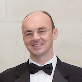
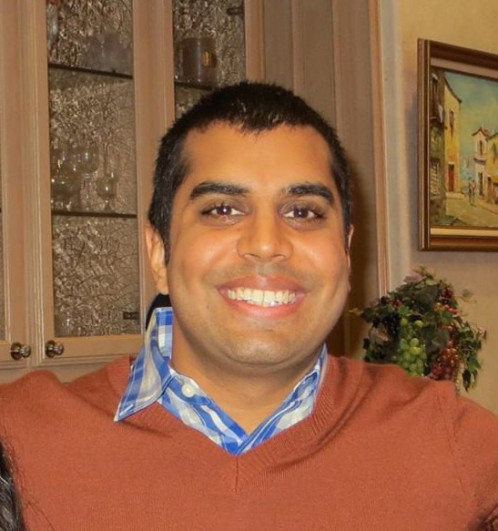
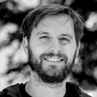
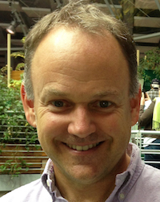

For questions and concerns, please contact [David Donoho](https://profiles.stanford.edu/david-donoho), [Hatef Monajemi](http://web.stanford.edu/~monajemi/) (@monajemi on GitHub) or [Vardan Papyan](http://vardanp.cswp.cs.technion.ac.il/). This class meets Wednesdays 3:00-4:20 PM at [200-002](https://campus-map.stanford.edu/?srch=200-002). If you are a guest speaker for this course, please read [travel section](#plan-your-visit) to plan your visit.   

* [Follow Stat385 on Twitter](https://twitter.com/stats385?lang=en)  

* [Follow Stat385 on ResearchGate (videos)](https://www.researchgate.net/project/Theories-of-Deep-Learning)  

## Deep Learning/AI News
 * [This Is The Future Of Artificial Intelligence](http://amp.timeinc.net/fortune/2016/06/15/future-of-work-2)

##  Guest Lectures

---

<a class="talkdate" href="./bolcskei_lecture">Wednesday, 10/11/17</a>  
Helmut Bolcskei  
ETH Zurich

---

<a class="talkdate" href="./patel_lecture">Wednesday, 10/18/17</a>  
Ankit Patel  
Rice and BCM

---

<a class="talkdate" href="./poggio_lecture">Wednesday, 10/25/17</a>  
Tomaso Poggio  
MIT

---

<a class="talkdate" href="./harchaoui_lecture">Wednesday, 11/01/17</a>  
Zaid Harchaoui  
UW

---

<a class="talkdate" href="./pennington_lecture">Wednesday, 11/08/17</a>  
Jeffrey Pennington  
Google, NY

---

<a class="talkdate" href="./bruna_lecture">Wednesday, 11/15/17</a>  
Joan Bruna  
Courant Institute, NYU

---

<a class="talkdate" href="./olshausen_lecture">Wednesday, 11/29/17</a>  
Bruno Olshausen  
UC Berkeley

---

<a class="talkdate" href="./papyan_lecture">Wednesday, 12/6/17</a>  
Vardan Papyan  
Stanford

## [Looking for a postdoc?](postdoc)

## [In the media](media)

## [Reading list and other resources](readings)

## [Lecture slides](lecture_slides)    

## [Basic information about deep learning](basicinfo)    

## [Cheat sheet -- stuff that everyone needs to know](cheat_sheet)    

## [The course in a single graph](http://bl.ocks.org/vardanp91/raw/be0f763405b76d33caefdaebc2ac3487/)

## [Blogs](blogs)

## [Grading](grading)

## [Plan your visit](speaker_visit)
