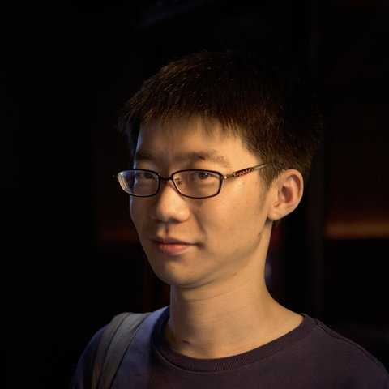
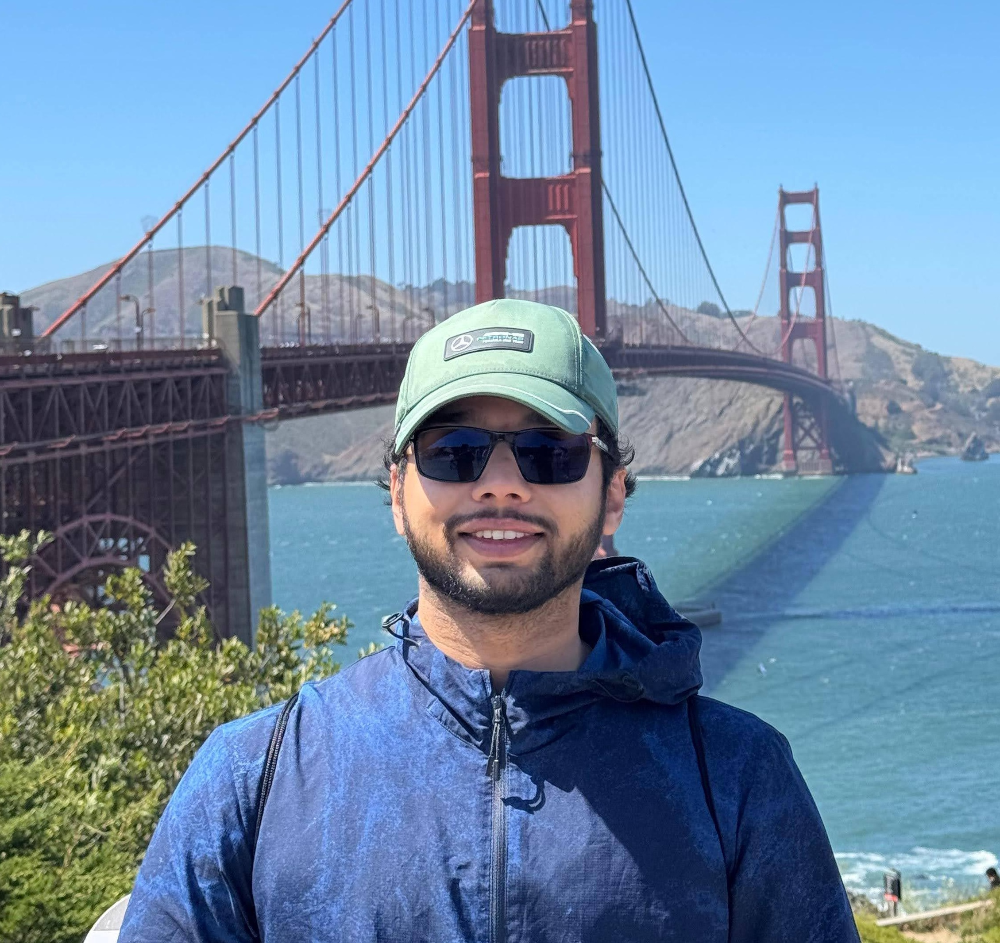
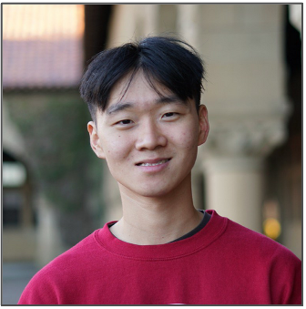

## Teaching Assistants

  

    
    
Pullabhatla Smriti

  

  

    
    
Peijing Li

  

  

    
    
Vyom Garg

  

  

    
    
Jake Cheng

  

This class meets Tuesday and Thursday from 10:30 - 11:50 AM in [CODA B60](https://campus-map.stanford.edu/?id=&lat=37.429924&lng=-122.17178&zoom=17&srch=07-430). 
Office hours of instructors and TAs are listed in Canvas.

## Schedule
<iframe src="https://docs.google.com/spreadsheets/d/1Aqpk1hEZD78bq0WoDe6edSs-tSC58hoEGCSJ6I--6KI/preview?gid=0" style="width: 130%; height: 100vh; display: block; border: none;"></iframe>
